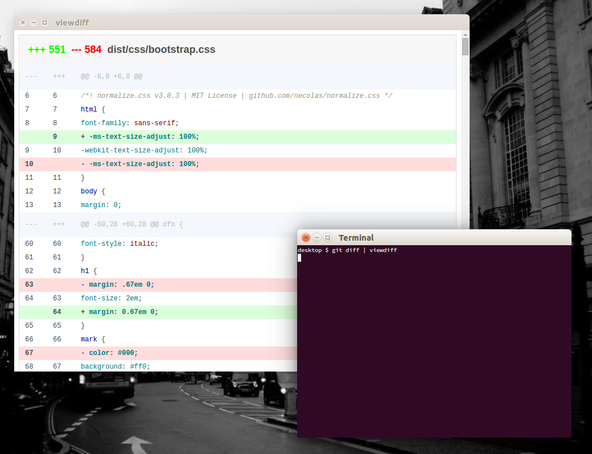

# viewdiff
[![NPM version][npm-image]][npm-url]
[![Downloads][downloads-image]][downloads-url]

> :ledger: view your diffs in a separate window.



## Install

```bash
$ npm install viewdiff -g
```

## Usage

`viewdiff` takes its input from `stdin`.

```bash
$ git diff | viewdiff
```

```bash
$ viewdiff < a.diff
```

## Contributors

* Ola Holmström (@olahol)
* Eric Hagman (@emhagman)

[npm-image]: https://img.shields.io/npm/v/viewdiff.svg?style=flat-square
[npm-url]: https://npmjs.org/package/viewdiff
[downloads-image]: http://img.shields.io/npm/dm/viewdiff.svg?style=flat-square
[downloads-url]: https://npmjs.org/package/viewdiff
